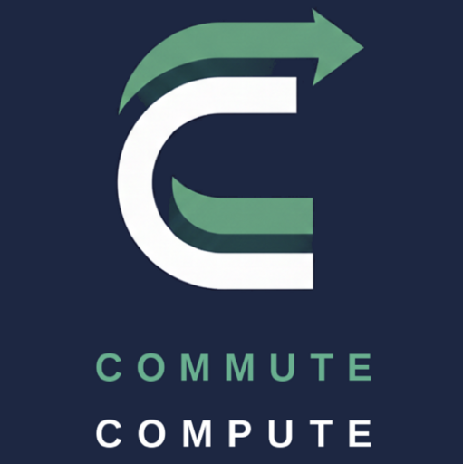

<p align="center">
  
</p>

<p align="center">
  <strong>Metro Tunnel compatible — Ready for the new network</strong>
</p>

# Commute Compute System™


### Smart Transit Display for Australian Public Transport


[](https://vercel.com/new/clone?repository-url=https://github.com/angusbergman17-cpu/CommuteCompute)

> Your personal e-ink transit dashboard. Real-time departures, smart journey planning, and the all-important coffee decision — rendered server-side and delivered to your display.
> First public release - development and bug fixes ongoing.
---

## ✨ Features

- 🚊 **Real-Time Transit Data** — Live departures from Transport Victoria, TfNSW, TransLink (GTFS-RT)
- ☕ **Smart Coffee Decision** — Calculates if you have time for coffee (including coffee-at-interchange)
- 🗺️ **Multi-Leg Journeys** — Walk → Coffee → Tram → Train → Walk with accurate timing
- 🧠 **SmartCommute™ Engine** — Auto-detects optimal routes across Australia
- 📱 **CC LiveDash™ Multi-Device** — Renders for TRMNL, Kindle, Inkplate, and web preview
- 🌤️ **Weather Integration** — BOM weather data at a glance
- 🖥️ **E-Ink Optimized** — 1-bit BMP rendering with 20-second partial refresh
- 🔒 **100% Self-Hosted** — Your data, your server, your API keys
- 🆓 **Free to Deploy** — Runs entirely on Vercel free tier (zero runtime API costs)
- 🚫 **No TRMNL Cloud** — CCFirm™ custom firmware, zero external dependencies
- 🇦🇺 **Multi-State Support** — VIC, NSW, QLD with more states planned

---

## 🏗️ Architecture

Commute Compute uses a **fully self-hosted distribution model** — each user deploys their own complete stack.

```
┌─────────────────────────────────────────────────────────────────────────┐
│                          YOUR DEPLOYMENT                                │
│                                                                         │
│    GitHub Fork              Your Server               Your Device       │
│   ┌───────────┐            ┌───────────┐            ┌───────────┐      │
│   │ Your Copy │   Deploy   │  Vercel   │   Image    │   TRMNL   │      │
│   │  of Repo  │ ────────▶  │  (Free)   │ ────────▶  │  Kindle   │      │
│   └───────────┘            └───────────┘            └───────────┘      │
│                                  │                        │            │
│                       Device Pairing ◄────────────────────┘            │
│                       (Code-based, Vercel KV)                           │
│                                                                         │
│   ✅ Complete data isolation between users                              │
│   ✅ Zero-config — no environment variables to edit                     │
│   ✅ Device pairing via 6-character code (like Chromecast)              │
│   ✅ CCFirm™ custom firmware — NO usetrmnl.com                          │
└─────────────────────────────────────────────────────────────────────────┘
```

**Key Principles:**
- **Server does ALL rendering** — fetches data, calculates routes, renders images
- **Device is dumb** — receives BMP image, displays it, sleeps
- **Zero-config deployment** — API keys configured via Setup Wizard, embedded in URL tokens
- **No TRMNL cloud** — CCFirm™ custom firmware connects only to YOUR server
- **Free-tier first** — All features work without paid APIs (OSM fallback for geocoding)

---

## 📱 Supported Devices

### TRMNL Devices (Primary)

| Device | Resolution | Orientation | Bit Depth | Status |
|--------|-----------|-------------|-----------|--------|
| **TRMNL OG** | 800×480 | Landscape | 1-bit BMP | ✅ Primary |
| **TRMNL Mini** | 400×300 | Landscape | 1-bit BMP | ✅ Supported |

### Kindle Devices (Jailbreak Required)

| Device | Resolution | Orientation | Bit Depth | Status |
|--------|-----------|-------------|-----------|--------|
| **Kindle Paperwhite 5** | 1236×1648 | Portrait | 8-bit PNG | ✅ Supported |
| **Kindle Paperwhite 3/4** | 1072×1448 | Portrait | 8-bit PNG | ✅ Supported |
| **Kindle Voyage** | 1072×1448 | Portrait | 8-bit PNG | ✅ Supported |
| **Kindle Touch/Basic** | 600×800 | Portrait | 8-bit PNG | ✅ Supported |

*See [DEVELOPMENT-RULES.md Section 6](DEVELOPMENT-RULES.md#-section-6-compatible-kindle-devices) for Kindle jailbreak instructions*

### Other Devices (Planned)

| Device | Resolution | Status |
|--------|-----------|--------|
| Inkplate 6 | 800×600 | 🔄 Planned |
| Inkplate 10 | 1200×825 | 🔄 Planned |
| Waveshare 7.5" | 800×480 | 🔄 Planned |

---

## 🚆 Supported Transit Systems

| State | Authority | API Status | Features |
|-------|-----------|------------|----------|
| **Victoria** | Transport Victoria (PTV) | ✅ Production | Full GTFS-RT, alerts, vehicle positions |
| **NSW** | Transport for NSW | ✅ Supported | GTFS-RT, trains, buses, ferries |
| **Queensland** | TransLink | ✅ Supported | GTFS-RT, SEQ services |
| **South Australia** | Adelaide Metro | 🔄 Planned | — |
| **Western Australia** | Transperth | 🔄 Planned | — |
| **Tasmania** | Metro Tasmania | 🔄 Planned | — |
| **ACT** | Transport Canberra | 🔄 Planned | — |
| **NT** | Public Transport Darwin | 🔄 Planned | — |

---

## 🚇 Melbourne Metro Tunnel Compliance

**Effective: 1 February 2026**

The SmartCommute™ engine is fully compliant with the Melbourne Metro Tunnel network changes. The tunnel transforms Melbourne's rail network by running five lines through new underground stations instead of the City Loop.

### Metro Tunnel Routes

| Line | Previous Route | New Route (Metro Tunnel) |
|------|----------------|--------------------------|
| **Sunbury** | City Loop | Arden → Parkville → State Library → Town Hall → Anzac |
| **Pakenham** | City Loop | Anzac → Town Hall → State Library → Parkville → Arden |
| **Cranbourne** | City Loop | Anzac → Town Hall → State Library → Parkville → Arden |

### New Underground Stations

| Station | Zone | Precinct | Interchange |
|---------|------|----------|-------------|
| **Arden** | 1 | North Melbourne | Trams to Docklands |
| **Parkville** | 1 | Hospital/University | RMH, Melbourne Uni, trams |
| **State Library** | 1 | CBD | RMIT, Swanston St trams |
| **Town Hall** | 1 | CBD | Collins St, Bourke St Mall |
| **Anzac** | 1 | Domain/St Kilda Rd | Shrine, St Kilda Rd trams |

### Discontinued City Loop Services

> ⚠️ **SmartCommute™ automatically handles these routing changes** — no user configuration required.

The following City Loop stations **no longer receive** Sunbury/Pakenham/Cranbourne services:

| Station | Alternative | Walk Time |
|---------|-------------|-----------|
| Southern Cross | Arden station | 12 min |
| Flagstaff | State Library | 5 min |
| Melbourne Central | State Library | 3 min |
| Parliament | Town Hall | 8 min |

These stations continue to be served by City Loop lines (Belgrave, Lilydale, Alamein, Glen Waverley, Hurstbridge, Mernda, Frankston, Sandringham, Werribee, Williamstown).

### Data Sources & Attribution

Metro Tunnel network data incorporated in SmartCommute™ is derived from:

- **Big Build Victoria** — [bigbuild.vic.gov.au/projects/metro-tunnel](https://bigbuild.vic.gov.au/projects/metro-tunnel)
- **Transport Victoria** — [ptv.vic.gov.au](https://ptv.vic.gov.au)
- **Victorian Government** — [vic.gov.au/metro-tunnel](https://vic.gov.au/metro-tunnel)
- **Transport Victoria OpenData API** — GTFS and GTFS-RT feeds (route and stop data)

*Metro Tunnel is a Victorian Government project delivered by Rail Projects Victoria.*

---

## 🚀 Quick Start

### Step 1: Deploy to Vercel

[](https://vercel.com/new/clone?repository-url=https://github.com/angusbergman17-cpu/CommuteCompute)

1. Click the button above
2. Sign in with GitHub
3. Name your project (e.g., `commute-compute-yourname`)
4. Click **Deploy**
5. Wait ~60 seconds

Your server will be live at: `https://[your-project-name].vercel.app`

### Step 2: Set Up Vercel KV Storage

**Required for API key persistence. Zero-Config compliant — no manual env var editing.**

1. In Vercel Dashboard, go to your project → **Storage** tab
2. Click **Create Database** → Select **KV** (Redis)
3. Choose region: **Sydney, Australia (Southeast)** recommended for AU users
4. Select plan: **Redis/30 MB** (free tier — plenty for config storage)
5. Name it (e.g., `CCKV` or `commute-compute-kv`)
6. Click **Create** → Vercel auto-links to your project
7. **Redeploy** to activate (Deployments → ⋮ → Redeploy)

> **Zero-Config:** Vercel automatically injects the KV credentials when you connect the database — you never manually edit environment variables. This is the same as how Vercel auto-injects `VERCEL_URL`. Your Transit API key (entered in Setup Wizard) is then stored in KV, not in env vars.

### Step 3: Run the Setup Wizard

Open your server URL:

```
https://[your-project-name].vercel.app/setup-wizard.html
```

Or use the full admin panel:

```
https://[your-project-name].vercel.app/admin
```

The **Setup Wizard** guides you through:
1. 🔑 Google Places API key (optional — OSM fallback available)
2. 📍 Home, work, and cafe addresses
3. 🚆 Transit authority selection (VIC/NSW/QLD)
4. 🔑 Transit API key (optional — works with fallback timetables)
5. ⏰ Arrival time and coffee preferences

### Step 4: Flash Custom Firmware

**⚠️ TRMNL devices require CCFirm™ custom firmware.**

```bash
cd firmware
pio run -e trmnl -t upload
```

See [DEVELOPMENT-RULES.md Section 5](DEVELOPMENT-RULES.md#-section-5-custom-firmware-requirement) for detailed flashing instructions.

**Do NOT use stock TRMNL firmware** — it connects to usetrmnl.com, not your server.

---

## 🎨 CCDash™ V11 Dashboard Layout

The dashboard displays your complete journey at a glance:

```
┌────────────────────────────────────────────────────────────┐
│ HEADER (0-94px)                                            │
│ [Location] [Time 12hr] [AM/PM] [Day Date] [Weather]        │
├────────────────────────────────────────────────────────────┤
│ SUMMARY BAR (96-124px)                                     │
│ LEAVE NOW → Arrive 7:25                              65min │
├────────────────────────────────────────────────────────────┤
│ JOURNEY LEGS (132-448px)                                   │
│ ① 🚶 Walk to stop                                    5 MIN │
│                         ▼                                  │
│ ② ☕ Coffee at Norman's                              8 MIN │
│                         ▼                                  │
│ ③ 🚃 Train to Flinders                              12 MIN │
├────────────────────────────────────────────────────────────┤
│ FOOTER (448-480px)                                         │
│ 80 COLLINS ST, MELBOURNE                  ARRIVE 8:32 AM   │
└────────────────────────────────────────────────────────────┘
```

**Design Specification:** [specs/CCDashDesignV12.md](specs/CCDashDesignV12.md) (🔒 LOCKED 2026-02-01)

---

## 📊 API Endpoints

### Dashboard Endpoints

| Endpoint | Method | Description |
|----------|--------|-------------|
| `/api/zones` | GET | Zone-based partial refresh (TRMNL) |
| `/api/zone/[id]` | GET | Single zone BMP |
| `/api/zonedata` | GET | All zones with metadata |
| `/api/screen` | GET | Full screen PNG (800×480) |
| `/api/livedash` | GET | CC LiveDash™ multi-device renderer |
| `/api/device/[token]` | GET | Device-specific endpoint |

### Setup Endpoints

| Endpoint | Method | Description |
|----------|--------|-------------|
| `/api/admin/setup-complete` | POST | Validate setup data |
| `/api/admin/generate-webhook` | POST | Generate config token URL |
| `/api/address-search` | GET | Geocoding (Google/OSM fallback) |
| `/api/cafe-details` | POST | One-time cafe data fetch |
| `/api/save-transit-key` | POST | Validate transit API key |
| `/api/save-google-key` | POST | Validate Google API key |

### System Endpoints

| Endpoint | Method | Description |
|----------|--------|-------------|
| `/api/health` | GET | Health check |
| `/api/status` | GET | Server status |
| `/api/pair/[code]` | GET/POST | Device pairing (Vercel KV persistent) |

### Pages

| URL | Description |
|-----|-------------|
| `/` | Landing page |
| `/admin` | Full admin panel with Setup Wizard |
| `/setup-wizard.html` | Streamlined Setup Wizard |
| `/simulator.html` | Device simulator |
| `/device-simulator.html` | Enhanced device simulator |
| `/preview.html` | Dashboard preview |
| `/help.html` | Help documentation |

---

## 📄 Documentation

### Essential Reading

| Document | Description |
|----------|-------------|
| **[DEVELOPMENT-RULES.md](DEVELOPMENT-RULES.md)** | 🚨 **MANDATORY** — All development rules (v1.15, 25 sections) |
| [docs/ARCHITECTURE.md](docs/ARCHITECTURE.md) | System architecture (v5.3) |
| [specs/CCDashDesignV12.md](specs/CCDashDesignV12.md) | Dashboard design spec (🔒 LOCKED 2026-02-01) |

### Setup & Installation

| Document | Description |
|----------|-------------|
| [docs/setup/SETUP-WIZARD-ARCHITECTURE.md](docs/setup/SETUP-WIZARD-ARCHITECTURE.md) | Setup Wizard architecture (v2.0) |
| [docs/setup/TROUBLESHOOTING-SETUP.md](docs/setup/TROUBLESHOOTING-SETUP.md) | Setup troubleshooting |
| [docs/GOOGLE-PLACES-SETUP.md](docs/GOOGLE-PLACES-SETUP.md) | Optional Google API setup |
| [SETUP_GUIDE.md](SETUP_GUIDE.md) | Step-by-step setup |

### Firmware

| Document | Description |
|----------|-------------|
| [firmware/README.md](firmware/README.md) | Firmware overview |
| [firmware/ANTI-BRICK-REQUIREMENTS.md](firmware/ANTI-BRICK-REQUIREMENTS.md) | ⚠️ Anti-brick rules |
| [firmware/BOOT-SEQUENCE.md](firmware/BOOT-SEQUENCE.md) | Boot sequence docs |
| [firmware/PAIRING-SPEC.md](firmware/PAIRING-SPEC.md) | Device pairing spec |

### Project

| Document | Description |
|----------|-------------|
| [docs/PROJECT-VISION.md](docs/PROJECT-VISION.md) | Project goals and roadmap (v2.0) |
| [docs/CHANGELOG.md](docs/CHANGELOG.md) | Version history |
| [LEGAL.md](LEGAL.md) | IP and licensing |

---

## 🛠️ Development

### Prerequisites

- Node.js 18+
- npm or yarn
- PlatformIO (for firmware)

### Local Development

```bash
git clone https://github.com/angusbergman17-cpu/CommuteCompute.git
cd CommuteCompute
npm install
npm run dev
# Open http://localhost:3000
```

### Firmware Development

```bash
cd firmware
pio run -e trmnl          # Compile
pio run -e trmnl -t upload  # Flash
pio device monitor         # Serial monitor
```

### Before ANY Code Changes

**⚠️ MANDATORY:** Read [DEVELOPMENT-RULES.md](DEVELOPMENT-RULES.md) first.

Key rules:
- CCDash™ CCDashDesignV10 spec is **LOCKED** — no changes without approval
- Never use "PTV API" — use "Transport Victoria OpenData API"
- CCFirm™ custom firmware only — NO usetrmnl.com dependencies
- 1-bit BMP rendering — no grayscale
- 20-second refresh — hardcoded, do not change
- AGPL v3 licence — required on all files
- No `allocBuffer()` in firmware (ESP32-C3 incompatibility)
- `FONT_8x8` only (rotation bug with other fonts)

---

## 🏷️ Trademarks

The following are unregistered trademarks owned by Angus Bergman:

- **Commute Compute™**
- **Commute Compute System™**
- **SmartCommute™**
- **CCDash™**
- **CC LiveDash™**
- **CCFirm™**

See [LEGAL.md](LEGAL.md) for full trademark and IP documentation.

---

## 📜 Licence

Commute Compute is dual-licensed:

- **Open Source:** [AGPL v3](LICENCE-AGPL-3.0) — free for open-source use
- **Commercial:** [Contact us](mailto:commutecompute.licensing@gmail.com) — for proprietary/closed-source use

See [LICENCE](LICENCE) for details.

---
## 🙏 Attribution

Commute Compute System™ uses data from:

- **Transport Victoria** — GTFS-RT data via OpenData API
- **Transport for NSW** — GTFS-RT data
- **TransLink Queensland** — GTFS-RT data
- **Bureau of Meteorology** — Weather data
- **OpenStreetMap** — Geocoding (Nominatim)

Third-party libraries retain their original licenses.

---

## 🗺️ Roadmap

Future development priorities:

| Feature | Status | Description |
|---------|--------|-------------|
| **📅 Calendar Integration** | 🔜 Next | Sync with Google/Outlook calendar for smart departure times based on appointments |
| **📱 Live Mobile Widgets** | 🔜 Next | iOS and Android home screen widgets with real-time commute info |
| **🇦🇺 More States** | 🔄 Planned | SA, WA, TAS, ACT, NT transit authority support |
| **🖥️ More Devices** | 🔄 Planned | Inkplate, Waveshare, custom ESP32 displays |
| **🔔 Push Notifications** | 💭 Exploring | Alert when disruptions affect your route |

Want to see a feature prioritized? [Open an issue](https://github.com/angusbergman17-cpu/CommuteCompute/issues) or sponsor development!

---

## 💖 Support

If Commute Compute helps you catch your train on time, consider supporting continued development:

[](https://buymeacoffee.com/angusbergman)
[](https://github.com/sponsors/angusbergman17-cpu)

**Your support helps fund:**
- 📅 Calendar integration development
- 📱 Native iOS/Android widget apps
- 🇦🇺 Additional state transit APIs
- 🖥️ New device support
- ☕ Coffee (essential for development)

---

<p align="center">
  <strong>Built with ☕ in Melbourne</strong><br>
  <sub>Copyright © 2025-2026 Angus Bergman — AGPL v3</sub>
</p>

---

## Legal & Ownership Notice

CommuteCompute is an **unincorporated software project and trade name**
created, authored, and owned by **Angus Bergman (individual)**.

CommuteCompute is **not** a registered company or separate legal entity
as of 1 February 2026.

All intellectual property rights vest exclusively in the author.

## Trademark Notice

CommuteCompute™, SmartCommute™, and associated marks are **claimed but
currently unregistered trademarks**.

## Licensing Summary

This project uses a **dual-licensing model**:

- Open-source components are licensed under **AGPL v3**
- Commercial and enterprise use requires a separate commercial license

See:
- LICENSE / LICENSE-AGPL-3.0.md
- LICENSING.md
- LICENCE-COMMERCIAL.md
