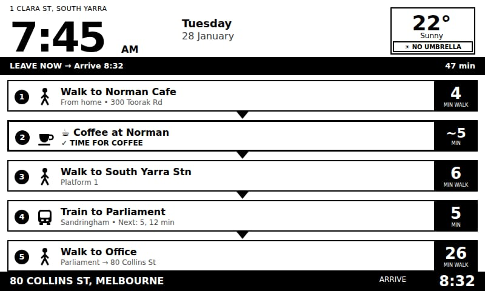
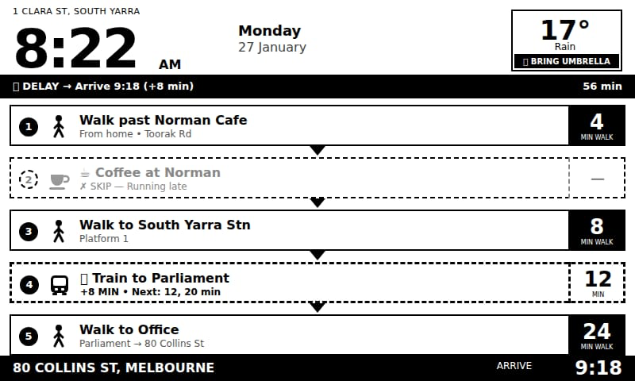
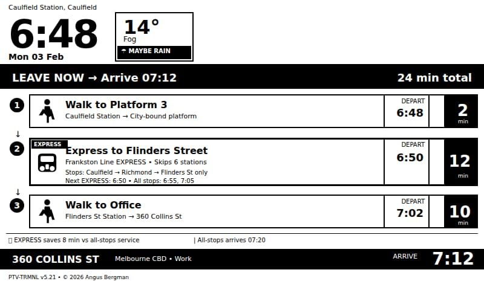
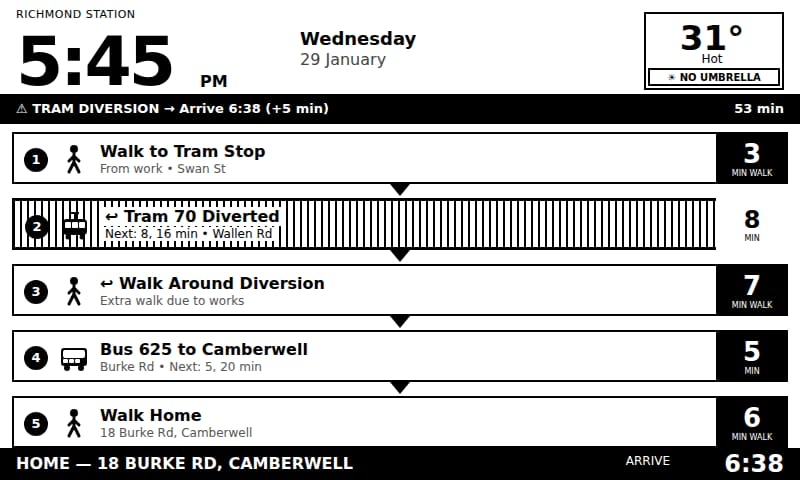
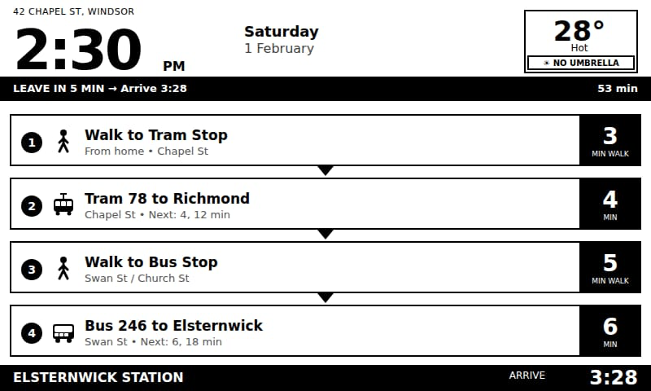
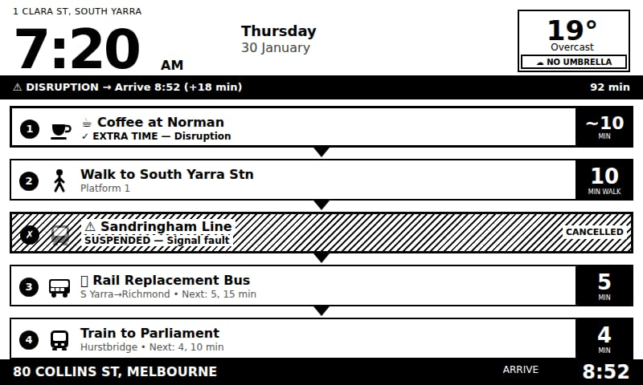
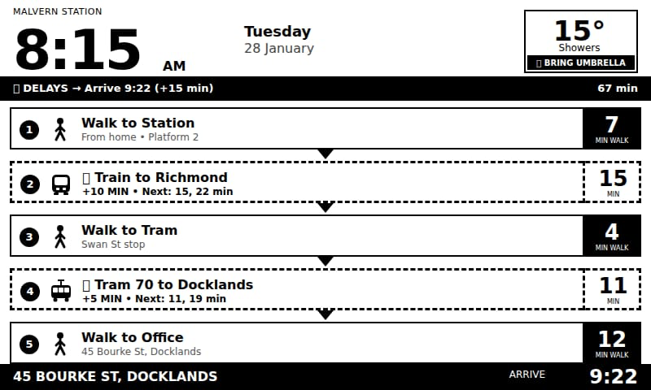
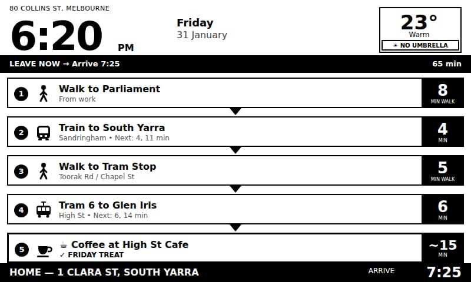
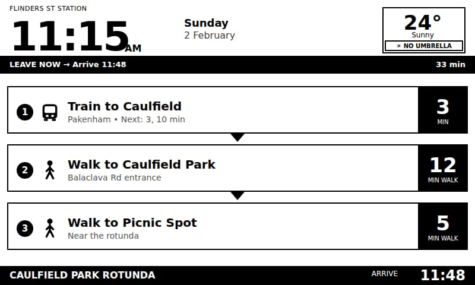

# Commute Compute System™
## Complete Project Overview

**Version:** 1.0  
**Date:** January 2026  
**Author:** Angus Bergman  
**License:** AGPL v3

---

# Part 1: Vision & Goals

## What is Commute Compute?

**Commute Compute System™** is a fully self-hosted smart transit display for Australian public transport. It delivers real-time journey information to beautiful e-ink displays, helping commuters know exactly when to leave — including whether there's time for coffee.

### The Problem We Solve

Every morning, commuters face the same questions:
- "When should I leave?"
- "Is my train delayed?"
- "Do I have time for coffee?"
- "Should I bring an umbrella?"

Commute Compute answers all of these at a glance on a dedicated e-ink display.

### Core Principles

| Principle | What It Means |
|-----------|---------------|
| **Privacy First** | Your data stays on YOUR server. No tracking, no analytics. |
| **Truly Free** | Runs on Vercel free tier. No subscriptions or hidden costs. |
| **Zero Dependencies** | Custom firmware connects only to your server — not to any cloud. |
| **Australian Focus** | Built for Australian transit: VIC, NSW, QLD supported. |
| **Open Source** | All code freely available under AGPL v3. |

---

## Brand Architecture

| Brand | Purpose |
|-------|---------|
| **Commute Compute System™** | Overall system name |
| **SmartCommute™** | Journey calculation engine |
| **CCDash™** | Dashboard rendering specification (V10) |
| **CC LiveDash™** | Multi-device live renderer |
| **CCFirm™** | Custom firmware family |

All trademarks © 2026 Angus Bergman.

---

## Project Scale

| Metric | Count |
|--------|-------|
| **Total Source Files** | 176 |
| **JavaScript** | 31,243 lines |
| **HTML** | 18,165 lines |
| **Markdown (docs)** | 23,960 lines |
| **C++ (firmware)** | 3,077 lines |
| **Total Lines of Code** | **76,445** |

---

## Target Users

### Primary: Australian Capital City Commuters
- Daily train/tram/bus commuters in Melbourne, Sydney, Brisbane
- Want to optimize their morning routine
- Value knowing exactly when to leave
- Appreciate the "coffee time" calculation

### Secondary: Smart Home Enthusiasts
- E-ink display hobbyists
- Open-source contributors
- IoT experimenters

---

# Part 2: System Architecture

## Self-Hosted Distribution Model

Every user deploys their own complete stack. There is no central server.

```
┌─────────────────────────────────────────────────────────────────────────┐
│                          YOUR DEPLOYMENT                                │
│                                                                         │
│    GitHub Fork              Your Server               Your Device       │
│   ┌───────────┐            ┌───────────┐            ┌───────────┐      │
│   │ Your Copy │   Deploy   │  Vercel   │   Image    │   TRMNL   │      │
│   │  of Repo  │ ────────▶  │  (Free)   │ ────────▶  │  E-ink    │      │
│   └───────────┘            └───────────┘            └───────────┘      │
│                                  │                        │            │
│                       Config Token in URL ◄───────────────┘            │
│                       (API keys embedded)                               │
│                                                                         │
│   ✅ Complete data isolation between users                              │
│   ✅ Zero-config — no environment variables to edit                     │
│   ✅ No central server dependency                                       │
└─────────────────────────────────────────────────────────────────────────┘
```

### Why Self-Hosted?

1. **Privacy**: Your commute patterns never leave your server
2. **Reliability**: No single point of failure
3. **Cost**: Vercel free tier is sufficient
4. **Control**: You own everything

---

## Technology Stack

| Layer | Technology |
|-------|------------|
| **Server** | Node.js 18+, Vercel Serverless |
| **Rendering** | @napi-rs/canvas, 1-bit BMP generation |
| **Transit Data** | GTFS-RT (VIC, NSW, QLD) |
| **Weather** | Bureau of Meteorology |
| **Firmware** | ESP32-C3, PlatformIO, C++ |
| **Display** | E-ink 800×480 (TRMNL), various Kindle |

---

## Data Flow

```
┌─────────────────────┐
│  Transit Authority  │  (Transport Victoria, TfNSW, TransLink)
│  GTFS-RT Feeds      │
└──────────┬──────────┘
           │
           ▼ 30s cache
┌─────────────────────┐
│  SmartCommute™      │  ← Journey calculation engine
│  Engine             │
└──────────┬──────────┘
           │
     ┌─────┴─────┬─────────────┐
     │           │             │
     ▼           ▼             ▼
┌─────────┐ ┌─────────┐ ┌─────────────┐
│ Weather │ │ Coffee  │ │ Disruption  │
│ (BOM)   │ │Decision │ │ Detection   │
└────┬────┘ └────┬────┘ └──────┬──────┘
     │           │             │
     └───────────┼─────────────┘
                 │
                 ▼
┌─────────────────────────────────────────┐
│           CCDash™ V10 Renderer          │
│   Creates 800×480 1-bit BMP image       │
└──────────────────┬──────────────────────┘
                   │
                   ▼
┌─────────────────────────────────────────┐
│           Your E-ink Device             │
│   Displays image, sleeps 20 seconds     │
└─────────────────────────────────────────┘
```

---

## Supported Devices

### TRMNL E-ink Displays (Primary)

| Device | Resolution | Status |
|--------|-----------|--------|
| **TRMNL OG** | 800×480 | ✅ Primary target |
| **TRMNL Mini** | 400×300 | ✅ Supported |

### Kindle E-readers (Jailbreak Required)

| Device | Resolution | Status |
|--------|-----------|--------|
| Kindle Paperwhite 5 | 1236×1648 | ✅ Supported |
| Kindle Paperwhite 3/4 | 1072×1448 | ✅ Supported |
| Kindle Voyage | 1072×1448 | ✅ Supported |

---

## Supported Transit Systems

| State | Authority | Status |
|-------|-----------|--------|
| **Victoria** | Transport Victoria (PTV) | ✅ Production |
| **NSW** | Transport for NSW | ✅ Supported |
| **Queensland** | TransLink | ✅ Supported |
| South Australia | Adelaide Metro | 🔄 Planned |
| Western Australia | Transperth | 🔄 Planned |

---

# Part 3: The SmartCommute™ Engine

## How It Works

The SmartCommute™ engine is the brain of Commute Compute. It calculates optimal journeys by:

1. **Fetching real-time data** from transit authorities (GTFS-RT)
2. **Detecting delays and disruptions** from service alerts
3. **Calculating multi-modal routes** (walk → tram → train → walk)
4. **Inserting coffee stops** when timing permits
5. **Adapting to disruptions** with alternative routes

### Key Capabilities

| Feature | Description |
|---------|-------------|
| **Real-time delays** | Shows actual delay in minutes (+5 MIN, +10 MIN) |
| **Service alerts** | Detects suspensions, diversions, cancellations |
| **Coffee decision** | Calculates if you have time for coffee |
| **Multi-modal** | Combines walk, train, tram, bus seamlessly |
| **Express detection** | Identifies express services that save time |
| **Weather integration** | Shows temperature and umbrella recommendation |

---

## CoffeeDecision Logic

The engine determines whether to include a coffee stop based on:

1. **Is coffee enabled?** (user preference)
2. **Is the cafe open?** (cached business hours)
3. **Will we still arrive on time?** (with coffee duration added)
4. **Should we skip due to delays?** (smart skip when running late)

### Coffee Patterns

| Pattern | Description |
|---------|-------------|
| **Origin** | Coffee before leaving (near home) |
| **Interchange** | Coffee at a transfer point |
| **Destination** | Coffee near work |
| **Skip** | No coffee when running late |

---

# Part 4: Dashboard Scenarios

The following images demonstrate how the SmartCommute™ engine handles various real-world scenarios. Each dashboard is rendered server-side and delivered to the e-ink display.

---

## Scenario 1: Normal Morning Commute with Coffee



**Location:** 1 Clara St, South Yarra  
**Time:** 7:45 AM Tuesday  
**Weather:** 22° Sunny, NO UMBRELLA

**What the engine calculated:**
- Total journey: 47 minutes to arrive at 8:32
- ✅ "TIME FOR COFFEE" — enough buffer to stop at Norman Cafe
- 5-leg journey: Walk → Coffee → Walk → Train → Walk
- Coffee duration shown as ~5 min (approximate)

**Visual elements:**
- Solid borders = normal service
- Coffee icon with checkmark = time confirmed
- Green status bar = "LEAVE NOW"

---

## Scenario 2: Delay with Coffee Skip



**Location:** 1 Clara St, South Yarra  
**Time:** 8:22 AM Monday  
**Weather:** 17° Rain, BRING UMBRELLA

**What the engine calculated:**
- Train is delayed +8 minutes
- Arrival pushed to 9:18 (+8 min late)
- ⚠️ Coffee SKIPPED — "Running late"
- Engine automatically removed coffee to minimize delay

**Visual elements:**
- Dashed border on coffee leg = SKIP state
- "✗ SKIP — Running late" status text
- Dashed border on train = delayed service
- Status bar shows "DELAY → Arrive 9:18 (+8 min)"

---

## Scenario 3: Express Service Detection



**Location:** Caulfield Station  
**Time:** 6:48 AM Monday  
**Weather:** 14° Fog, MAYBE RAIN

**What the engine calculated:**
- Detected EXPRESS service on Frankston Line
- Express skips 6 stations (Caulfield → Richmond → Flinders St only)
- Shows time savings: "EXPRESS saves 8 min vs all-stops service"
- Next all-stops service also shown for reference

**Visual elements:**
- "EXPRESS" badge on service
- Detailed stop information
- Footer note comparing express vs all-stops
- Alternative departure times shown

---

## Scenario 4: Tram Diversion



**Location:** Richmond Station  
**Time:** 5:45 PM Wednesday  
**Weather:** 31° Hot, NO UMBRELLA

**What the engine calculated:**
- Tram 70 is diverted due to works
- Route adapted: Tram (partial) → Walk around diversion → Bus
- Total journey extended to 53 minutes
- Status shows "TRAM DIVERSION → Arrive 6:38 (+5 min)"

**Visual elements:**
- "← Tram 70 Diverted" with arrow indicating diversion
- "← Walk Around Diversion" extra walking leg added
- Dashed borders on affected legs
- Bus replacement shown as alternative

---

## Scenario 5: Multi-Modal Journey (Tram + Bus)



**Location:** 42 Chapel St, Windsor  
**Time:** 2:30 PM Saturday  
**Weather:** 28° Hot, NO UMBRELLA

**What the engine calculated:**
- Journey requires tram then bus connection
- Tram 78 to Richmond, then Bus 246 to Elsternwick
- Walking segments between modes
- Total: 53 minutes, arrive 3:28

**Visual elements:**
- Different icons for each mode (tram vs bus)
- Transfer walks clearly shown
- "Next: 4, 12 min" shows upcoming service frequency

---

## Scenario 6: Major Disruption with Rail Replacement



**Location:** 1 Clara St, South Yarra  
**Time:** 7:20 AM Thursday  
**Weather:** 19° Overcast, NO UMBRELLA

**What the engine calculated:**
- Sandringham Line SUSPENDED (signal fault)
- Rail replacement bus inserted automatically
- Journey rerouted: Bus → Richmond → Train
- Extra time available → coffee added ("EXTRA TIME — Disruption")
- Total delay: +18 minutes

**Visual elements:**
- Diagonal stripe pattern = CANCELLED/SUSPENDED
- "CANCELLED" text on affected service
- "⚠ Sandringham Line SUSPENDED — Signal fault"
- Rail Replacement Bus leg automatically inserted
- Status: "DISRUPTION → Arrive 8:52 (+18 min)"

---

## Scenario 7: Multiple Delays



**Location:** Malvern Station  
**Time:** 8:15 AM Tuesday  
**Weather:** 15° Showers, BRING UMBRELLA

**What the engine calculated:**
- Train to Richmond delayed +10 minutes
- Tram 70 to Docklands delayed +5 minutes
- Combined delay: +15 minutes
- Status shows "DELAYS" (plural)

**Visual elements:**
- Multiple legs with dashed borders
- "+10 MIN" and "+5 MIN" shown on respective legs
- Status bar: "DELAYS → Arrive 9:22 (+15 min)"

---

## Scenario 8: Evening Commute with Friday Treat



**Location:** 80 Collins St, Melbourne  
**Time:** 6:20 PM Friday  
**Weather:** 23° Warm, NO UMBRELLA

**What the engine calculated:**
- Reverse commute (work → home)
- Coffee at destination (High St Cafe, Glen Iris)
- Special "FRIDAY TREAT" status for end-of-week coffee
- 65 minute journey including coffee

**Visual elements:**
- "✓ FRIDAY TREAT" — special end-of-week status
- Coffee at end of journey (destination pattern)
- Evening weather and warm temperature

---

## Scenario 9: Weekend Leisure Trip



**Location:** Flinders St Station  
**Time:** 11:15 AM Sunday  
**Weather:** 24° Sunny, NO UMBRELLA

**What the engine calculated:**
- Non-work journey (leisure destination)
- Simple route: Train → Walk to park → Walk to picnic spot
- Destination: "Caulfield Park Rotunda"
- 33 minutes total

**Visual elements:**
- Different destination type (park, not work)
- "Near the rotunda" descriptive text
- Weekend date format
- No coffee (leisure trip)

---

# Part 5: Setup & Deployment

## Zero-Config Architecture

Users never need to edit environment variables. All configuration happens through the Setup Wizard and is encoded into a URL token.

```
SETUP (one-time)                    RUNTIME (automatic)
────────────────                    ──────────────────
1. Enter addresses          →       All data cached in URL:
2. Geocode locations        →       • Home/work/cafe lat/lon
3. Select transit authority →       • API keys
4. Enter preferences        →       • Coffee settings
5. Generate webhook URL     →       • State selection
                                    
Device fetches from YOUR URL with embedded config.
No server-side storage required.
```

## Free-Tier First

The entire system works on free infrastructure:

| Service | Cost | Required |
|---------|------|----------|
| Vercel Hosting | FREE | ✅ Yes |
| Transport Victoria API | FREE | ✅ Yes |
| BOM Weather | FREE | ✅ Yes |
| OpenStreetMap Geocoding | FREE | Fallback |
| Google Places | Paid | ❌ Optional |

---

# Part 6: Technical Specifications

## Dashboard Layout (CCDash™ V10)

```
┌────────────────────────────────────────────────────────────┐
│ HEADER (0-94px)                                            │
│ [Location] [Time 64px] [AM/PM] [Day] [Weather]             │
├────────────────────────────────────────────────────────────┤
│ SUMMARY BAR (96-124px)                                     │
│ LEAVE NOW → Arrive 7:25                              47min │
├────────────────────────────────────────────────────────────┤
│ JOURNEY LEGS (132-448px)                                   │
│ ① 🚶 Walk to Norman Cafe                             4 MIN │
│                         ▼                                  │
│ ② ☕ Coffee at Norman                               ~5 MIN │
│                         ▼                                  │
│ ③ 🚶 Walk to South Yarra Stn                         6 MIN │
│                         ▼                                  │
│ ④ 🚃 Train to Parliament                             5 MIN │
│                         ▼                                  │
│ ⑤ 🚶 Walk to Office                                 26 MIN │
├────────────────────────────────────────────────────────────┤
│ FOOTER (448-480px)                                         │
│ 80 COLLINS ST, MELBOURNE                    ARRIVE 8:32    │
└────────────────────────────────────────────────────────────┘
```

## Leg States

| State | Visual | When Used |
|-------|--------|-----------|
| **Normal** | Solid black border | Service running normally |
| **Delayed** | Dashed border, "+X MIN" | Service delayed |
| **Skip** | Dashed border, grayed | Coffee skipped |
| **Cancelled** | Diagonal stripes | Service suspended |
| **Diverted** | Dashed + arrow | Route diverted |

## Status Bar Variants

| Status | Display |
|--------|---------|
| Normal | `LEAVE NOW → Arrive 8:32` |
| Leave Soon | `LEAVE IN 5 MIN → Arrive 8:32` |
| Delay | `⏱ DELAY → Arrive 8:40 (+8 min)` |
| Delays | `⏱ DELAYS → Arrive 8:45 (+13 min)` |
| Disruption | `⚠ DISRUPTION → Arrive 9:00 (+28 min)` |
| Diversion | `⚠ TRAM DIVERSION → Arrive 8:38 (+6 min)` |

---

# Part 7: Roadmap

## Completed ✅

- Core server architecture
- CCDash™ CCDashDesignV10 specification
- SmartCommute™ engine
- CC LiveDash™ multi-device renderer
- CCFirm™ custom firmware
- Victoria, NSW, Queensland support
- Setup Wizard with zero-config
- Comprehensive documentation

## In Progress 🔄

- End-to-end testing
- Additional device support
- Polish and error handling

## Planned 🔲

- South Australia, Western Australia, Tasmania support
- Inkplate and Waveshare device support
- Video tutorials
- Public launch

---

# Summary

Commute Compute System™ is a privacy-respecting, fully self-hosted smart transit display that:

1. **Shows real-time departures** from Australian transit authorities
2. **Calculates optimal routes** across multiple transport modes
3. **Decides if you have time for coffee** based on your schedule
4. **Adapts to delays and disruptions** automatically
5. **Runs for free** on Vercel with no ongoing costs
6. **Protects your privacy** — your data never leaves your server

The project succeeds when a Melbourne commuter can glance at their e-ink display, see "LEAVE NOW — Coffee included", and walk out the door knowing they'll catch their train on time.

---

**Built with ☕ in Melbourne**

*Copyright © 2025-2026 Angus Bergman — AGPL v3*
